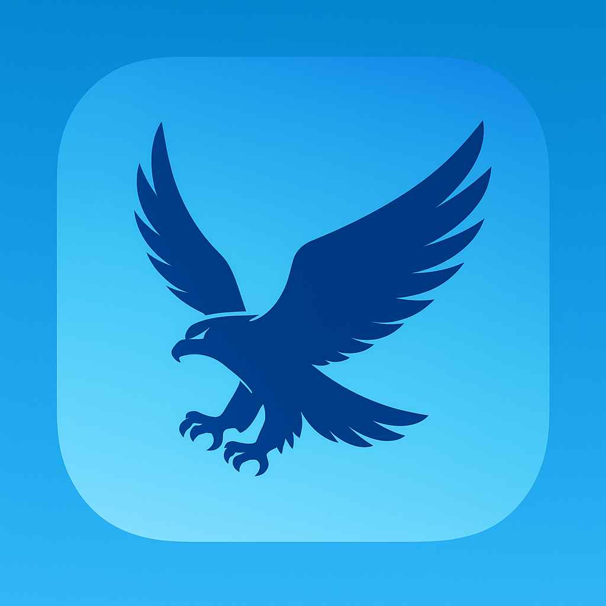

# 연스타그램 (Yeonstagram)

Yonsei University Instagram Clone with MiniKit & mint.club v2



## 🌟 프로젝트 소개

연스타그램은 연세대학교를 테마로 한 Instagram 클론으로, Farcaster MiniKit과 mint.club v2 SDK를 활용한 Web3 소셜 플랫폼입니다.

### ✨ 주요 기능

- **🎯 개인 토큰 발행**: 각 사용자마다 `BASED{USERNAME}` 토큰 생성
- **📸 NFT 포스트**: 이미지를 NFT로 민팅하여 Instagram 스타일 피드에 표시
- **🔗 Farcaster 연동**: MiniKit을 통한 사용자 인증 및 프로필 정보 연동
- **☁️ IPFS 저장**: Filebase를 통한 탈중앙화 이미지 저장
- **🎨 Instagram UI**: 연세대학교 브랜드 컬러를 활용한 깔끔한 인스타그램 스타일 UI
- **⚡ 부드러운 애니메이션**: Framer Motion을 활용한 Instagram 수준의 사용자 경험

## 🚀 시작하기

### 사전 요구사항

- Node.js 18+
- npm 또는 yarn
- Filebase 계정 (IPFS 업로드용)
- Farcaster 계정

### 설치 및 실행

1. **저장소 클론**
   ```bash
   git clone https://github.com/your-repo/yeonstagram.git
   cd yeonstagram
   ```

2. **의존성 설치**
   ```bash
   npm install
   ```

3. **환경변수 설정**
   
   `.env.local` 파일을 생성하고 다음 값을 설정하세요:
   ```
   NEXT_PUBLIC_FILEBASE_API_KEY=your_filebase_api_key
   ```
   
   Filebase API 키 설정은 [`FILEBASE_SETUP.md`](FILEBASE_SETUP.md)를 참고하세요.

4. **개발 서버 실행**
   ```bash
   npm run dev
   ```

5. **브라우저에서 확인**
   ```
   http://localhost:3000
   ```

## 🏗️ 프로젝트 구조

```
yeonstagram/
├── app/
│   ├── page.tsx              # 메인 앱 컴포넌트
│   ├── layout.tsx            # 레이아웃 설정
│   └── api/                  # API 라우트
├── components/
│   ├── ProfileHeader.tsx     # 프로필 헤더 컴포넌트
│   ├── PostGrid.tsx          # 포스트 그리드 컴포넌트
│   ├── CreatePostModal.tsx   # 포스트 생성 모달
│   └── MotionConfig.tsx      # 애니메이션 설정
├── hooks/
│   ├── useUserToken.ts       # 사용자 토큰 관리 훅
│   ├── usePosts.ts           # 포스트 관리 훅
│   └── useReducedMotion.ts   # 접근성 모션 설정 훅
├── lib/
│   ├── animations.ts         # 애니메이션 상수
│   └── redis.ts              # Redis 캐싱
├── types/
│   └── index.ts              # TypeScript 타입 정의
├── constants/
│   └── index.ts              # 앱 상수 및 설정값
└── server/
    └── ipfs.ts               # IPFS 업로드 서버 액션
```

## 🔧 주요 기능

### 1. 사용자 토큰 시스템

각 사용자는 Farcaster 사용자명을 기반으로 한 개인 토큰을 발행할 수 있습니다.

- **토큰명**: `BASED{USERNAME}` (예: BASEDTOM)
- **네트워크**: Base Sepolia 테스트넷
- **토큰경제**: 지수함수 커브 (초기가격 0.0000001 ETH → 최종가격 0.1 ETH)

### 2. NFT 포스트 생성

사용자는 이미지를 업로드하여 NFT 포스트를 생성할 수 있습니다.

- **Reserve Token**: 사용자의 개인 토큰
- **이미지 저장**: IPFS (Filebase)
- **메타데이터**: JSON 형태로 IPFS에 저장
- **이미지 압축**: 자동 압축으로 최적화

### 3. Instagram 스타일 UI/UX

- **브랜드 컬러**: 연세대학교 공식 컬러 (#0E4A84)
- **그리드 레이아웃**: 3x3 Instagram 스타일 포스트 그리드
- **부드러운 애니메이션**: 페이지 전환, 호버 효과, 모달 등
- **반응형 디자인**: 모바일/데스크톱 최적화

## 🛠️ 기술 스택

- **프론트엔드**: Next.js 14, React, TypeScript, Tailwind CSS
- **애니메이션**: Framer Motion
- **Web3**: mint.club v2 SDK, Farcaster MiniKit
- **블록체인**: Base Sepolia (테스트넷)
- **저장소**: IPFS (Filebase)
- **이미지 처리**: browser-image-compression
- **알림**: react-hot-toast

## 🌐 배포

### Vercel (권장)

1. GitHub에 프로젝트 푸시
2. [Vercel](https://vercel.com)에서 프로젝트 연결
3. 환경변수 설정
4. 자동 배포 완료

### 기타 플랫폼

- Netlify
- Railway
- Render

## 🔐 환경변수

필수 환경변수:

```env
# Filebase IPFS
NEXT_PUBLIC_FILEBASE_API_KEY=your_filebase_api_key
```

## 📱 사용법

1. **사용자 연결**: Farcaster 계정으로 로그인
2. **토큰 활성화**: "활성화" 버튼을 클릭하여 개인 토큰 생성
3. **포스트 생성**: "+" 버튼을 클릭하여 이미지 업로드 및 NFT 포스트 생성
4. **피드 확인**: Instagram 스타일 그리드에서 포스트 확인

## 🧪 테스트

```bash
# 개발 서버 실행
npm run dev

# 빌드 테스트
npm run build

# 타입 체크
npm run type-check

# 린트 체크
npm run lint
```

## 🤝 기여하기

1. Fork the repository
2. Create your feature branch (`git checkout -b feature/amazing-feature`)
3. Commit your changes (`git commit -m 'Add some amazing feature'`)
4. Push to the branch (`git push origin feature/amazing-feature`)
5. Open a Pull Request

## 📄 라이선스

이 프로젝트는 MIT 라이선스 하에 배포됩니다.

## 🙋‍♂️ 문의사항

프로젝트에 대한 문의사항이 있으시면 Issues를 통해 연락해주세요.

---

**Yeonstagram** - Yonsei University × Instagram × Web3